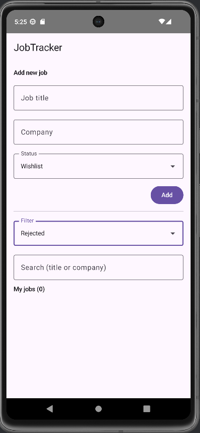

# JobTracker 📋

An Android job application tracking app built with **Jetpack Compose**.

JobTracker helps you organize and track your job applications in a clean, simple, and modern Android interface.

---

## ✨ Features

- ➕ Add job applications (title, company, status)
- 🔄 Update application status (Wishlist, Applied, Interview, Offer, Rejected)
- 🔍 Search by job title or company
- 🏷 Filter applications by status
- 💾 Persistent local storage using DataStore
- 🎨 Modern UI with Material 3 & Jetpack Compose

---

## 🛠 Tech Stack

- **Language:** Kotlin
- **UI:** Jetpack Compose (Material 3)
- **Architecture:** Single-activity Compose app
- **Storage:** Android DataStore (Preferences)
- **Tools:** Android Studio, GitHub

---

## 📱 Screenshots


### Add Job & Job List


---

### Status Update (Applied → Interview → Offer)


---

### Filter by Status


---

### Empty State (Rejected filter)



> Tip: Add screenshots from the emulator later to showcase the UI.

---

## 🚀 Getting Started

1. Clone the repository:
   ```bash
   git clone https://github.com/stelaras36/JobTracker.git
